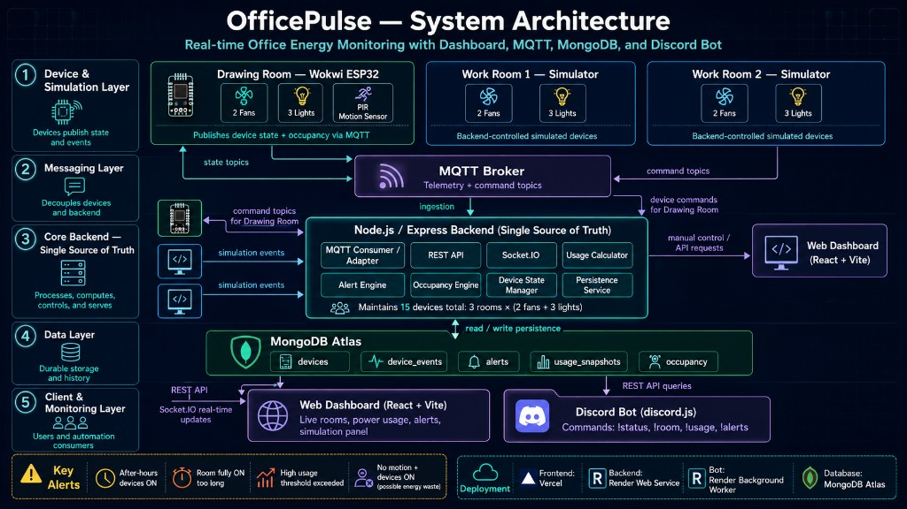
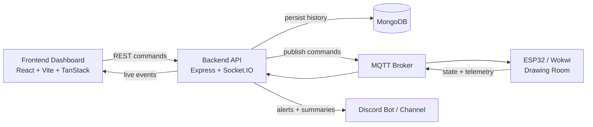

# OfficePulse

OfficePulse is a hybrid smart-office energy monitoring and control platform. It combines a real-time web dashboard, a Node.js backend, MQTT-connected hardware for the Drawing Room, simulator-backed digital twin rooms, optional MongoDB persistence, and Discord-based alert visibility.

The current system topology is intentionally mixed:

- `Drawing Room` is hardware-backed through MQTT and the `smartoffice/drawing/*` topic family.
- `Work Room 1` and `Work Room 2` run as simulator-driven rooms.
- The backend stays central and acts as the single source of truth for control, telemetry, alerts, history, and realtime fan-out.

## Why This Project Exists

OfficePulse is built to answer a practical smart-office question:

> How do you monitor office power usage, control devices, detect waste, and surface alerts across web, hardware, and chat interfaces without letting each surface invent its own version of the truth?

This repo solves that by putting the backend in the middle and letting every other surface read or react to the same shared state.

## Core Capabilities

- Real-time dashboard for rooms, devices, usage, alerts, and recent activity
- Hybrid office model with both hardware-backed and simulator-backed rooms
- MQTT bridge for physical/Wokwi-connected devices in the Drawing Room
- Socket.IO push updates for live frontend synchronization
- Smart alerting for:
  - after-hours devices left on
  - high power usage
  - device or hardware bridge offline conditions
  - rooms staying fully on too long
- Optional MongoDB persistence for device state, alerts, and usage snapshots
- Discord integration for remote status checks and alert broadcasting
- Simulation tools for testing alert scenarios and room behavior without hardware

## System Architecture





### Live control flow

1. A user toggles a device from the dashboard.
2. The frontend sends the request to the backend.
3. The backend decides whether that device is:
   - a `drawing` hardware-room device, or
   - a simulator-room device in `work1` or `work2`
4. For hardware devices, the backend publishes an MQTT command.
5. For simulator devices, the backend updates the in-memory state directly.
6. The backend emits confirmed updates through Socket.IO so every client converges on the same state.

## Current Room Topology

| Room | Source | Devices |
|---|---|---|
| `drawing` | MQTT / Wokwi / hardware bridge | 2 fans, 3 lights |
| `work1` | simulator | 2 fans, 3 lights |
| `work2` | simulator | 2 fans, 3 lights |

## Tech Stack

### Frontend

- React 19
- Vite
- TanStack Router
- Zustand
- Socket.IO client
- Tailwind CSS 4

### Backend

- Node.js
- TypeScript
- Express
- Socket.IO
- MQTT.js
- Zod
- Mongoose
- Discord.js

### Integrations

- MongoDB for persistence
- HiveMQ/public MQTT or compatible broker
- Wokwi/ESP32 simulation
- Discord bot + channel alerts

## Repository Layout

```text
.
├── backend/                      # API, MQTT bridge, socket fan-out, alerts, persistence
├── frontend/                     # Realtime dashboard UI
├── bot/                          # Standalone Discord bot client
├── hardware/                     # Hardware/Wokwi-related workspace
├── IUT-Hackathon-IoT-Circuit-/   # Detailed hackathon hardware simulation module
├── docs/                         # Project docs
├── render.yaml                   # Render deployment config for backend
└── package.json                  # Root convenience scripts
```

## Getting Started

### Prerequisites

- Node.js 20+
- npm
- Optional: MongoDB
- Optional: MQTT broker
- Optional: Discord bot token
- Optional: Wokwi or real ESP32 hardware

### 1. Install dependencies

This repo is not using a full npm workspace install for every app, so install dependencies per app:

```bash
npm install
npm install --prefix frontend
npm install --prefix backend
npm install --prefix bot
```

Notes:

- Root `npm install` gives you the convenience scripts such as `dev:all`.
- `backend/`, `frontend/`, and `bot/` each keep their own dependencies.
- If you do not plan to use the standalone bot, `bot` is optional.

### 2. Create environment files

Copy these example files and fill in the values you need:

- `backend/.env.example` -> `backend/.env`
- `frontend/.env.example` -> `frontend/.env`
- `bot/.env.example` -> `bot/.env` only if you want the standalone bot

### 3. Minimum local configuration

#### `frontend/.env`

```env
VITE_API_URL=http://localhost:5000
VITE_SOCKET_URL=http://localhost:5000
```

#### `backend/.env`

The backend can run in a minimal local mode with:

```env
PORT=5000
NODE_ENV=development
CLIENT_URL=http://localhost:5173
ENABLE_SIMULATOR=true
ENABLE_RANDOM_SIMULATOR=false
MONGODB_URI=
MQTT_BROKER_URL=mqtt://broker.hivemq.com:1883
MQTT_CLIENT_ID=officepulse-backend-local
MQTT_HARDWARE_TOPIC_PREFIX=smartoffice/drawing
WOKWI_OFFLINE_TIMEOUT_SECONDS=60
DISCORD_TOKEN=
DISCORD_CHANNEL_ID=
```

Important behavior:

- If `MONGODB_URI` is blank, the backend runs in memory-only mode.
- If `DISCORD_TOKEN` is blank, the embedded Discord bot stays disabled.
- If `MQTT_BROKER_URL` is blank, the hardware MQTT bridge stays disabled.
- Simulator rooms can still work even when hardware integration is unavailable.

#### `bot/.env` (optional standalone bot)

```env
DISCORD_TOKEN=
BACKEND_API_URL=http://localhost:5000
DISCORD_CHANNEL_ID=
DISCORD_ALERT_NOTIFICATIONS_ENABLED=true
LLM_ENABLED=false
```

## Running the Project

### Recommended local workflow

Start the backend:

```bash
npm run dev:backend
```

Start the frontend in another terminal:

```bash
npm run dev:frontend
```

Then open:

- Frontend: `http://localhost:5173`
- Backend health: `http://localhost:5000/api/health`

### Run frontend + backend together

```bash
npm run dev:all
```

### Run the standalone Discord bot

Only do this if you want the separate `bot/` app:

```bash
npm run dev:bot
```

## Embedded Discord vs Standalone Bot

This repo currently supports two Discord approaches:

### Embedded backend bot

Recommended for simpler deployment.

- Configure `DISCORD_TOKEN` in `backend/.env`
- Start the backend
- The backend will start its Discord client during bootstrap

### Standalone `bot/` app

Useful if you want the bot process separated from the backend.

- Configure `bot/.env`
- Run `npm run dev:bot`
- The bot reads live office data from the backend API

## Hardware and MQTT

The hardware-backed room is `drawing`.

The backend publishes commands to topic patterns like:

```text
smartoffice/drawing/light1/set
smartoffice/drawing/light2/set
smartoffice/drawing/light3/set
smartoffice/drawing/fan1/set
smartoffice/drawing/fan2/set
smartoffice/drawing/master/set
```

The hardware publishes state back on topic patterns like:

```text
smartoffice/drawing/light1/state
smartoffice/drawing/light2/state
smartoffice/drawing/light3/state
smartoffice/drawing/fan1/state
smartoffice/drawing/fan2/state
smartoffice/drawing/motion/state
```

For the detailed simulation module and wiring reference, see:

- `hardware/README.md`
- `IUT-Hackathon-IoT-Circuit-/README.md`

## Frontend Pages

The dashboard includes dedicated views for:

- `/` main command center dashboard
- `/rooms` room overview
- `/rooms/$roomId` room detail
- `/alerts` active + historical alerts
- `/simulation` scenario testing and simulator controls
- `/architecture` interactive system-flow explainer

## Key Backend API Areas

The backend exposes routes for:

- `/api/health`
- `/api/state`
- `/api/rooms`
- `/api/usage`
- `/api/alerts`
- `/api/devices`
- `/api/integrations`
- `/api/telemetry`
- `/api/simulator`
- `/api/activity`

## Alert Model

The main alert types currently surfaced in the UI and backend include:

- `AFTER_HOURS_ON`
- `ROOM_FULLY_ON_TOO_LONG`
- `HIGH_USAGE`
- `DEVICE_OFFLINE`

These alerts are evaluated from shared backend state so the dashboard, history, and Discord output stay aligned.

## Persistence Model

When MongoDB is configured, OfficePulse can persist:

- device state
- alerts
- device events
- usage snapshots

When MongoDB is not configured, the system still works locally, but state is reset on restart.

## Deployment

The repo includes `render.yaml` for backend deployment on Render.

The current deployment setup:

- builds from `backend/`
- runs the backend as a web service
- supports optional MongoDB, MQTT, and Discord environment variables
- can switch to HiveMQ websocket mode automatically in hosted runtime when needed

## Troubleshooting

### Frontend shows demo or disconnected state

Check:

- backend is running on `http://localhost:5000`
- `frontend/.env` points to the correct API and socket URLs
- `CLIENT_URL` in `backend/.env` allows your frontend origin

### Hardware commands are not reaching the Drawing Room

Check:

- `MQTT_BROKER_URL` is set
- the broker is reachable
- the backend is subscribed and connected
- the hardware/Wokwi side is using the same `smartoffice/drawing` topic family

### Discord alerts are not posting

Check:

- `DISCORD_TOKEN` is valid
- `DISCORD_CHANNEL_ID` is set if you want channel-restricted posting
- `DISCORD_ALERT_NOTIFICATIONS_ENABLED=true`

### History is missing after restart

Check:

- `MONGODB_URI` is configured
- the database is reachable

## Project Status

OfficePulse already demonstrates a strong hybrid control architecture:

- one real hardware-backed room
- two simulator-backed rooms
- live telemetry and socket fan-out
- shared alert semantics
- optional persistence and Discord visibility

That makes it a good base for hackathon demos, smart-office experiments, and future expansion into more rooms or more advanced automation policies.
